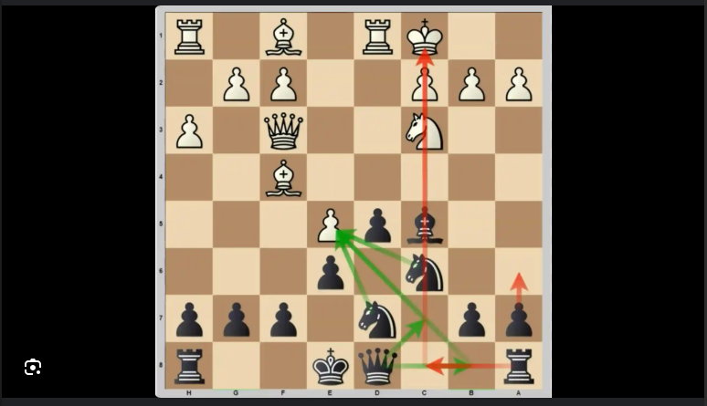

# fen_converter

A lightweight command-line tool for turning a chessboard screenshot into a FEN (Forsyth–Edwards Notation) record. The workflow detects the board automatically and then walks you through each square so that the final FEN is guaranteed to be correct.



## Features

- Automatic chessboard detection with perspective correction using OpenCV.
- Square-by-square image slicing and ASCII previews for reliable manual verification.
- A quick heuristic classifier that pre-fills whether a square is empty and guesses the piece colour, saving time during review.
- Generates a standards-compliant FEN string that can optionally be written to a file.

## Installation

Create and activate a virtual environment and install the dependencies:

```bash
python -m venv .venv
source .venv/bin/activate
pip install -r requirements.txt
pip install -e .
```

## Usage

Convert an image and print the FEN:

```bash
python -m fen_converter.cli convert path/to/screenshot.png
```

Once installed you can call the package entry point:

```bash
fen-converter convert path/to/screenshot.png
```


Accept the suggestions automatically (non-interactive mode):

```bash
python -m fen_converter.cli convert path/to/screenshot.png --no-interactive
```

Preview the classifier suggestions without generating a FEN:

```bash
python -m fen_converter.cli suggest path/to/screenshot.png
```

Save the rectified board that the detector uses:

```bash
python -m fen_converter.cli convert examples/diagram.png --save-board artifacts/board.png
```

## Tests

The included unit tests validate board detection, square extraction, and FEN construction.
Run them with:

```bash
pytest
```
